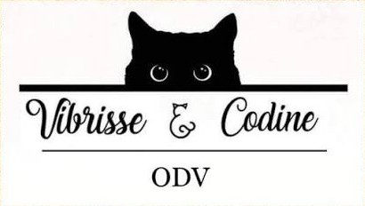

<div align="center">



# 🐾 ODV Vibrisse & Codine
### *Ogni baffo merita cure, ogni coda merita casa.*

Sito web ufficiale dell'Organizzazione di Volontariato **Vibrisse & Codine**,
attiva a **Cava de' Tirreni (SA)** nella sterilizzazione, cura e adozione
responsabile dei gatti.

[](#)
[](#)
[](#)
[](#)

</div>

---

## 🐈 Chi siamo

Vibrisse & Codine nasce dalla sensibilità e dall'amore per gli animali, in
particolare per i gatti — troppo spesso non sufficientemente tutelati dalla
normativa vigente rispetto ad altri animali d'affezione, come i cani. Dal
2023 l'associazione è riconosciuta come **ODV, Organizzazione di
Volontariato**.

L'associazione si occupa di:

- 🩺 **Sterilizzazione** dei gatti di strada, per contrastare il randagismo;
- 🍽️ **Cura quotidiana** delle colonie feline del territorio;
- 🏡 **Adozioni gratuite e responsabili**, con controllo dell'abitazione
  ospitante e documenti scritti a tutela del gatto;
- 🎟️ **Lotterie di beneficenza** con montepremi, per finanziare le cure.

## ℹ️ Generali

- **Indirizzo:** Via Onofrio di Giordano 53, Cava de' Tirreni (SA)
- **Orari:** ogni giorno, 11:00–12:30 e 18:00–19:30
- **Telefono:** 340 292 9928
- **Email:** vibrissecodine@gmail.com


---

## ✨ Il sito

Un sito **one-page** pensato per raccontare l'associazione in modo caldo,
professionale e immediatamente riconoscibile — a partire dal segno grafico
del logo stesso: tratto blu inchiostro, anello arancio, carta color crema.

| Sezione | Descrizione |
|---|---|
| **Hero** | Presentazione della missione con illustrazione animata in stile "baffo" |
| **Chi siamo** | Storia, natura giuridica (ODV) e valori dell'associazione |
| **Cosa facciamo** | Le quattro aree di attività, in schede animate |
| **Adozioni** | Il percorso di adozione responsabile, passo per passo |
| **Galleria** | Slider scorrevole con le foto dei gatti seguiti dall'associazione |
| **Sostienici** | IBAN e PayPal per le donazioni, con pulsante "copia" |
| **Contatti** | Indirizzo, orari, telefono, email, social e mappa interattiva |

### Design

- **Palette**: crema `#F7F1E4`, blu inchiostro `#17324D`, arancio `#E07B39`,
  ispirati direttamente al logo dell'associazione.
- **Tipografia**: *Fraunces* per i titoli, *Work Sans* per i testi, *Caveat*
  (calligrafica) per gli accenti — a richiamare il tratto disegnato a mano
  del logo.
- **Firma grafica**: un "filo di baffo" disegnato in SVG che si anima
  tracciandosi da solo a ogni scroll tra una sezione e l'altra.
- **Animazioni**: rivelazioni al momento dello scroll, micro-interazioni al
  passaggio del mouse, rispetto delle preferenze `prefers-reduced-motion`.
- Completamente **responsive**, da mobile a desktop.

### 🌍 Sito multilingua

In alto a destra è disponibile un selettore di lingua con **bandiera e nome
nella lingua originale**, elencate in ordine alfabetico e dotate di un campo
di ricerca. La traduzione avviene in tempo reale tramite il motore di
**Google Translate**, integrato in modo invisibile: il visitatore non vede
mai l'interfaccia standard di Google, solo la tendina personalizzata del
sito.

### 🖼️ Galleria fotografica

Le immagini della galleria della galleria presentano
immagini aggiornate dei nostri amici a quattro zampe!😻

---

## 📁 Struttura del progetto

```
.
├── index.html              # pagina principale del sito
├── css/
│   └── style.css           # design system, layout, animazioni
├── js/
│   ├── languages.js         # elenco lingue disponibili (codice, nome, bandiera)
│   ├── translate.js         # ponte con il widget Google Translate
│   └── main.js               # interazioni: menu, slider, scroll reveal, selettore lingua
├── assets/
│   ├── logo.png              # logo dell'associazione (header e footer)
│   ├── watermark.png         # firma "manu1394©" (il creatore) nel footer
│   └── gallery/               # foto dei gatti mostrate nello slider
└── README.md
```

<div align="center">

Realizzato con 🐾 per l'**ODV Vibrisse & Codine** — Cava de' Tirreni (SA)

`manu1394©`

</div>
